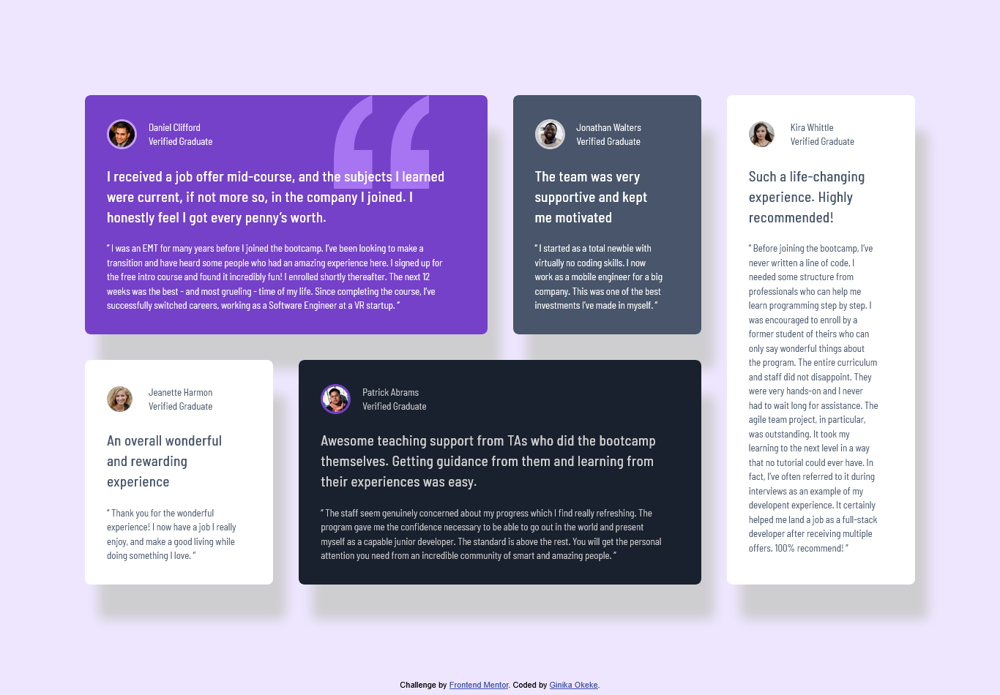

# Frontend Mentor - Testimonials grid section solution

This is a solution to the [Testimonials grid section challenge on Frontend Mentor](https://www.frontendmentor.io/challenges/testimonials-grid-section-Nnw6J7Un7). Frontend Mentor challenges help you improve your coding skills by building realistic projects. 

## Table of contents

- [Overview](#overview)
  - [The challenge](#the-challenge)
  - [Screenshot](#screenshot)
  - [Links](#links)
- [My process](#my-process)
  - [Built with](#built-with)
  - [What I learned](#what-i-learned)
- [Author](#author)

## Overview

### The challenge

Users should be able to:

- View the optimal layout for the site depending on their device's screen size

### Screenshot

### Links

- Solution URL: [Add solution URL here](https://your-solution-url.com)
- Live Site URL: [Add live site URL here](https://your-live-site-url.com)

## My process
- I used a Mobile-first workflow to develop the web page and CSS grid.
### Built with

- Semantic HTML5 markup
- CSS custom properties
- CSS Grid
- Mobile-first workflow

### What I learned

I learned how to use CSS Z-index propert to push elements a layer deeper or further up the layout. This was very important when dealing with the quotation image in the first grid item and with a weird box-shadow issue that only affected a single element when  in the tablet layout. I also learned you can make an image have a circle border by setting border-radius to 50% and make an element invisible using the CSS visibility property.

## Author

- Frontend Mentor - [@ginikaifeanyi88-web](https://www.frontendmentor.io/profile/ginikaifeanyi88-web)
